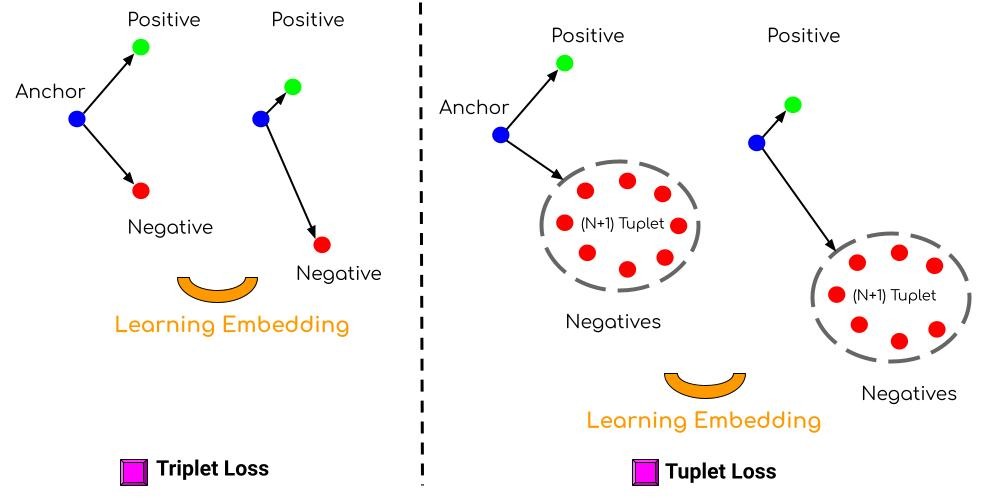

# Face Verification with Tuplet Loss

This repository implements a face verification system based on FaceNet, fine-tuned using Tuplet Loss.  
The project leverages PyTorch for deep learning and focuses on learning discriminative embeddings for facial images, especially in scenarios where faces are close to the camera, such as in eKYC systems.

The implementation builds upon the [facenet-pytorch](https://github.com/timesler/facenet-pytorch.git) repository. Only the pre-trained FaceNet model from this repository was used; the idea of Tuplet Loss is not included in facenet-pytorch. Tuplet Loss was implemented separately in this project based on the following paper:  

- Yu, Baosheng, and Dacheng Tao. ["Deep metric learning with tuplet margin loss."](https://openaccess.thecvf.com/content_ICCV_2019/html/Yu_Deep_Metric_Learning_With_Tuplet_Margin_Loss_ICCV_2019_paper.html) *Proceedings of the IEEE/CVF International Conference on Computer Vision*, 2019.  


<p align="center">
  
  
  
</p>


## Features
- Fine-tuned FaceNet model for face verification.  
- **Tuplet Loss**: Uses one positive sample and multiple negative samples for robust learning.  
- **Hard Negative Mining**: During training, 
1. we first select `random negative samples` in the dataset. 
2. In the loss function, we then pick the `k hardest negatives` from these random selections based on their difficulty, meaning the ones most similar to the anchor. This helps the model focus on the most challenging examples to improve learning efficiency.

- The model learns to create embeddings that can better distinguish between similar faces, improving its ability to measure facial distances accurately.
- This approach is especially useful when dealing with difficult scenarios, such as when faces are captured at close range, where subtle differences are harder to detect.


### What is Tuplet Loss?

Tuplet Loss is a deep metric learning approach that extends the concept of Triplet Loss.  
While Triplet Loss compares an anchor to one positive sample and one negative sample, Tuplet Loss leverages multiple negative samples (tuples) in addition to the anchor and positive pair. This makes the learning process more robust and effective, especially in scenarios with fine-grained differences between classes.

The image below illustrates the difference between Triplet Loss and Tuplet Loss. Triplet Loss uses one positive and one negative sample for learning embeddings, whereas Tuplet Loss leverages (N+1) samples, including multiple negatives, to learn more discriminative features.  



#### Key Features of Tuplet Loss in This Implementation:
- **8 Tuplet Negative Samples**: In this project, each anchor is compared against 8 negative samples instead of a single negative sample, providing richer contrastive signals during training.  
- **Hard Negatives Instead of Random Negatives**: Rather than selecting negative samples randomly, this implementation dynamically selects the hardest negatives (based on their distance to the anchor) from the mini-batch. This ensures that the model focuses on the most challenging examples, improving its ability to differentiate between similar-looking faces.  

The combination of multiple negatives and hard negative mining allows for more discriminative embeddings, enabling the system to excel in face verification tasks with subtle inter-class variations.  


### root structure
The directory structure of this repository is organized as follows:

```bash
root:
    |__ finetune.py
    |__ inference.py
    |__ weight/
    |__ docs/
    |__ readme.md

```


### Dataset
I used a custom dataset for training, which consists of images where faces are typically close to the camera, and the height of the images is larger than the width.
The dataset is composed of the following:

- eKYC images: 12,018 IDs and 102,147 images in total.
- Pre-processing: For each sample, the faces are cropped using the MTCNN face detection model.


#### Data preparation
```
Train Directory format
    |---nationalID1
    |     |--cropped_face_img1
    |     |--cropped_face_img2
    |     |...
    |     |--cropped_face_img10
    |---nationalID2
    |     |--cropped_face_img1
    |     |--cropped_face_img2
    |     |...
    |     |--cropped_face_img10
    |...
    |---nationalIDN
    |     |--cropped_face_img1
    |     |--cropped_face_img2
    |     |...
    |     |--cropped_face_img10
```
Afterward, I fine-tuned these cropped face images using a triplet loss function.


### Resources:
I used the following device for training:


|      GPU     | RTX-3060 |
|--------------|----------|
| Cuda version |   11.8   |


### training metrics
For face verification, we focus on learning an embedding space where faces of the same individual are close together, and faces from different individuals are far apart. 
A critical challenge is minimizing the penalty when two discriminative faces are incorrectly detected as similar, as this can severely impact the model's performance. 
Therefore, we monitor various metrics during training to ensure that the model maintains a high level of discrimination between faces.

#### Training log:

|   metric1  |  metric2  |  metric3 | metric4 | metric5 | metric6 | metric7 | metric8 |
|------------|-----------|----------|---------|---------|---------|---------|---------|
| Train_Loss |  Val_Acc  | Val_Prec | Val_Rec | Val_F1  | Val_TPR | Val_FPR | Val_FNR |


### Download pretrained weigths
The checkpoint obtained from training with the triplet loss is located in the `weight` directory.


### Inference : Finding Optimal Threshold based on distance similarity
In face verification, we determine the similarity between face embeddings and classify whether two images belong to the same person. 

This process involves:

- Embedding Extraction: Use `MTCNN` for face detection and InceptionResnetV1 for face embeddings extraction.
- Distance Calculation: Compute the Euclidean distance between face embeddings for pairs of images.
- Threshold Search: Evaluate a range of thresholds (0.1 to 1.5) to determine if pairs match or not.
- Metrics: For each threshold, calculate the False Positive Rate (FPR), False Negative Rate (FNR), and weighted cost (FPR: 0.8, FNR: 0.2).
- Optimal Threshold: The threshold with the lowest cost is selected as the optimal threshold for face verification. In the Face Verification (FV) project, FPR is more critical than FNR, so the weighting is skewed towards minimizing FPR.

For my Test dataset, which includes 7998 unique samples (or unique national IDs), the optimal threshold was found to be `0.9422`, with the following metrics:

For the Test version of my dataset, the optimal threshold was found to be `0.9422`, with the following metrics:

```bash

=== Threshold Search Results ===

Optimal Threshold: `0.9422`


|   Best FPR    |   Best FNR   |   Minimum Cost   |
|---------------|--------------|------------------|
|    0.0026     |    0.0132    |     0.0048       |

```


### Installation
Clone the repository:

```bash
git clone https://github.com/your-username/face-verification-tuplet-loss.git
pip install -r requirements.txt
```

**Note: Install PyTorch Based on CUDA Version**
To ensure compatibility with your system's CUDA version, you need to install the appropriate version of torch.
Since my CUDA version is `11.8`, I installed `torch==2.0.1+cu118`.

#### Training the Model (Fine tune):
To fine tune the model, run this:
```bash
python3 finetune.py
```
#### Training Details
- Model: Fine-tuned FaceNet using PyTorch.
- Loss Function: Tuplet Loss with one positive and multiple negative samples (here, 8 negative samples are selected).
- Optimization:
              - Optimizer: Adam
- Learning Rate: 1e-4
- Batch Size: 32
- Number of epochs: 65
- Embedding Dimension: 512-dimensional vectors for face embeddings.
- Preprocessing:
               - Face detection and alignment using MTCNN (from facenet-pytorch).
               - Normalization of input images.


#### Inference the Model:
To verify two face images, run this:

```bash
python3 inference.py
```

#### Evaluation image
